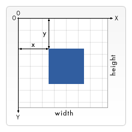

# 소개


`Transform`은 오브젝트의 위치(Position), 회전(Rotation), 크기(Scale)을 결정하는 컴포넌트이며,

`unity`, `unreal` 을 비롯한 사용엔진은 `Transform`을 통해 게임오브젝트의 공간적 속성을 정의하며, 부모자식 관계를 관리합니다,

`Three.js`의 경우 `Mesh` 오브젝트의 `add` 메서드로 부모-자식 관계의 관리를 자체적으로 제공해주지만,

성능향상을 위해 `InstancedMesh`을 도입해야할 경우, `Herarchy System`을 직접 구현해야만 합니다.

즉, Web3d 엔진을 위해선 복잡한 계층구조를 자체적으로 관리할 수 있는 `Scene Graph`기반의 `Transform`시스템을 구현하는것입니다.

본 프로젝트는 `HTML 2D Canvas`의 `CanvasRenderingContext2D: setTransform()`을 활용한 좌표변환 기술을 통해 간단한 2d transform을 구현하기 위해 진행되었습니다.


# 기능 설명


우측 컨트롤러 영역에 입력값을 넣어, canvas내의 사각형 도형을 제어하는 프로젝트 입니다.

사각형의 좌표, 회전, 원점 정보에 따른 display 정보를 시뮬레이션 가능합니다.


# 기술 설명


## 1. 좌표계 변환



`html canvas`는 좌측상단을 원점으로 하며, 아랫방향이 y축인 좌표계를 지닙니다.

본 프로젝트에서는 캔버스 중앙을 원점으로 두고, 윗방향을 y축으로 나타내기 위해 아래와 같은 좌표계 변환 공식을 통해 `world matrix`를 정의했습니다.

```js
// canvas는 상단이 (-) 축이다.
// 하지만 과제의 그래프는 상단이 (+) 축이다.
// 그러므로 y축 방향을 뒤집기 위해, World 좌표계의 y축 방향을 반전시킨다
let mat = new DOMMatrix([1, 0, 0, -1, 0, 0]);

// canvas 좌측 하단이 원점이 되도록 만들기 위한 수평이동.
mat.translateSelf(0, -canvas.height);

// 이제 canvas 중앙이 (0,0)이 되도록 만들어야 한다.
// canvas의 가로 및 세로 길이의 절반만큼 수평이동한다.
mat.translateSelf(canvas.offsetWidth / 2, canvas.offsetHeight / 2);
```


## 2. world matrix에 대한 꼭짓점 좌표 획득
주어진 좌표, 회전, 원점 정보에 따른 4개의 꼭짓점 좌표를 world matrix에 대해 출력하기 위해 아래와 같은 연산을 수행하였습니다.

```js
// tmp_org_matrix : world matrix
// this.matrix : canvas matrix에 대한 사각형의 transform matrix
// this.matrix_by_org : world matrix에 대한 사각형의 transform matrix
this.matrix_by_org = tmp_org_matrix.invertSelf().multiply(this.matrix);
```

위 처럼 `invert matrix`를 도입하여, `canvas matrix`에 대한 `transform matrix`를 `world matrix`에 대해 변환하는 작업을 수행할 수 있었습니다.


# 실행방법

https://scarecrow1992.github.io/johan-transformation/

위 링크에서 실행 가능

또는

VSC로 프로젝트를 연후 index.html 파일을 라이브서버로 열어주세요!


# 수정 내역
- 25.9.1 (월)
  - 모바일 가로화면 해상도 대응 (화면 높이 750px 미만)
  - 모바일 세로화면 해상도 대응 (화면 너비 700px 미만)
  - 모바일 해상도 적용시, 오브젝트 스케일을 0.5배로 설정하여 뷰포트 표시영역을 넓힌다.
    (World Matrix의 각 축 스케일 벡터 길이를 0.5로 설정)


# 문의
- e-mail : gogowjdgo1@gmail.com